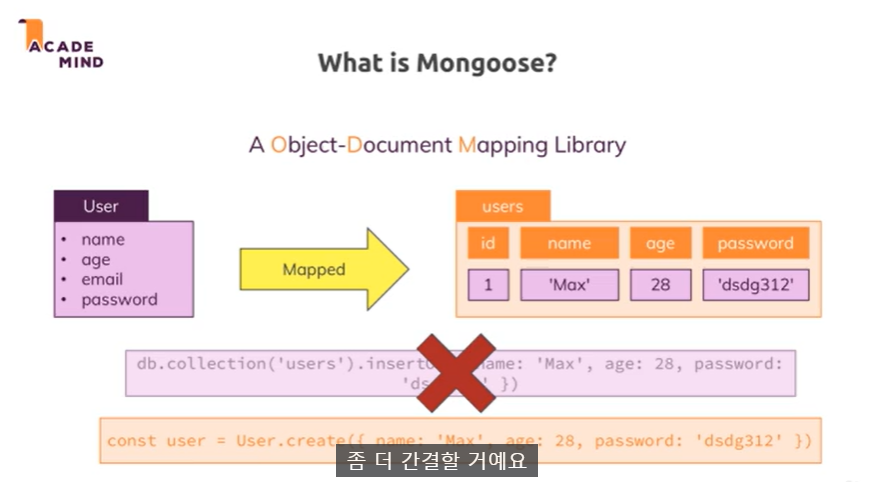
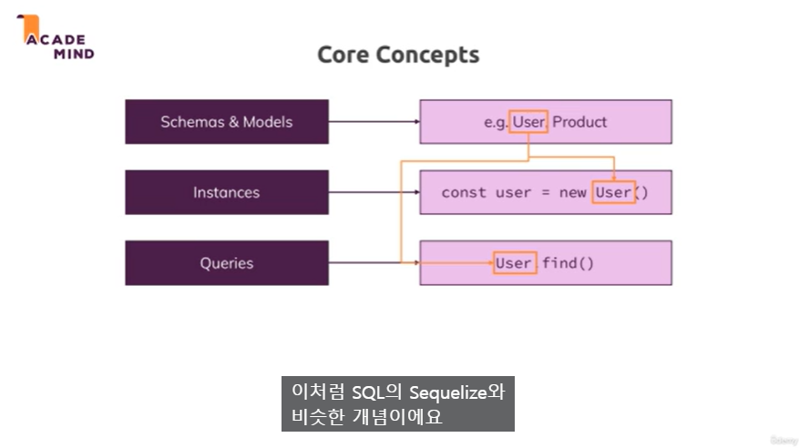

# Section 13: Mongoose 작업

### 209. 모듈 소개

- Mongoose

  - SQL에 Sequelize가 있었던 것처럼 MongoDB에는 Mongoose가 있다.
  - 쿼리 대신 데이터를 다룰 수 있도록 만든다.

- Mongoose가 무엇인지
- Node.js Apps에서 이용하는 방법

### 210. Mongoose란?

- Mongoose는 ODM(Object-Document Mappong Library) 이다.
  - Sequelize는 ORM(Object Relational Mapping Library)
- 단순히 관계형 데이터 베이스가 아니라 문서 관점인 문서 데이터 베이스
- Sequelize처럼 Mongoose는 모델을 정의해서 모든 쿼리가 배후에서 작성되도록 돕는다.

- Mongoose의 핵심 개념은 스키마와 모델을 다뤄 데이터가 어떻게 보일지 정의한다.
- 또 인스턴스로 모델에 예시를 제시해서 계획에 따라 JavaScript 객체를 생성할 수 있도록 한다.
- 설정을 마치면 User 객체 및 모델을 통해 데이터베이스에 쿼리를 실행한다.
