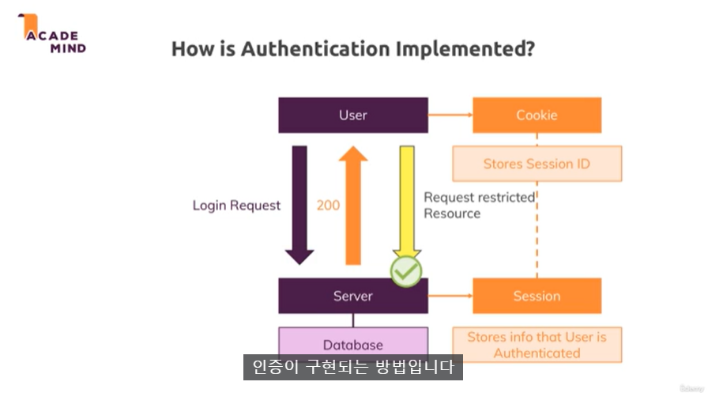
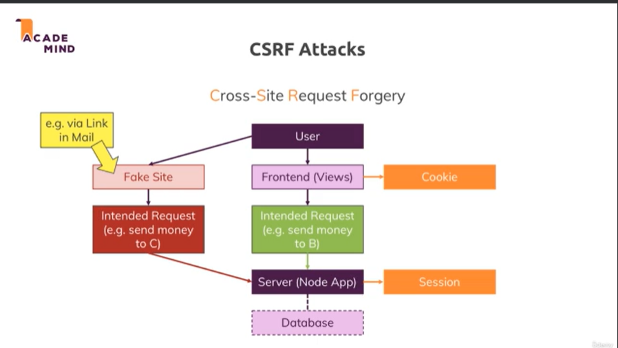

# Section 14: 인증 추가

### 250. 모듈 소개

- 인증이 무엇인지?
- 자격 증명을 저장하고 활용
- Protecting Routes

### 251. 인증이란?



- 우리가 다루는 애플리케이션에서 제품과 로그인 사용자를 연결해야 한다.
- 바로 이를 위해 인증 절차가 필요
- 로그인 하지 않은 익명의 사용자와 로그인 한 사용자를 구분

### 255. 비밀번호 암호화하기

```bash
npm install --save bcryptjs
```

- 암호화를 돕는 패키지

```ts
bcrypt.hash(password, 12);
```

- 2번째 인수:: salt 값:: 몇 차례의 해시 값을 가질 것인지

### 257. 로그인 기능 추가하기

```ts
bcrypt.compare(password, user.password);
```

- 해시 값과 일치하는지 비교

### 260. CSRF 공격의 이해



- CSRF Attacks: Cross-Site Request Forgery
- 사이트 간 요청 위조
- 이는 세션을 악용하고 애플리케이션 사용자를 속여서 악성코드를 실행하게 하는 특수한 공격 방법 또는 접근법이다.
- 사용자의 로그인 세션 정보를 악용해서 알아채지 못하는 요청을 보낸다.
- 해결법: CSRF 토큰을 이용하여 사용자가 뷰를 렌더링 할 때만 사용자의 세션을 사용할 수 있게 한다.

### 261. CSRF 토큰 사용하기

```bash
npm install --save csurf
```

### 263. csurf()의 대안

안타깝게도 이 강좌의 일부 섹션에서 사용된 csurf 패키지는 현재 더 이상 유지되지 않습니다. 개발팀은 최근 이 인기 있는 패키지를 더 이상 사용해서는 안 된다며, 더 이상 사용하지 않는다고 발표했습니다.(https://github.com/expressjs/csurf#deprecated).

해당 과정 강의의 목적은 CSRF 공격의 일반적인 원리를 설명하는 것입니다. 공격은 코드에서 로컬로만 시뮬레이션되므로 더 이상 사용되지 않는 패키지를 학습 목적으로 안전하게 사용할 수 있습니다.

하지만 실전에서는 다른 패키지를 선택해야 합니다 (https://www.npmjs.com/search?q=express%20csrf). 예를 들어, csurf() 와는 다른 API를 사용하는 이 패키지를 사용하는 것을 고려할 수 있습니다:https://www.npmjs.com/package/csrf-csrf

강의영상과 코드 스냅샷에서 볼 수 있듯이, 이 강좌의 서포트는 현재 여전히 csurf() API에 중점을 두고 있다는 점을 이해해 주시기 바랍니다.

그리고 가장 중요한 것은 이 강좌에서 설명하는 일반적인 원칙이 패키지와 독립적이라는 점입니다. (패키지 종류와 무관하게 적용됨)

### 269. 마무리

- authentication
  - 인증 상태를 저장하는 데 세션을 사용하게 되며, 이 세션으로 제어되는 로그인 상태를 요청이 컨트롤러 액션에 도달하기 직전에 검사해서 라우트에서 일반적인 코드를 보호할 수 있다.
- Security & UX
  - 비밀번호는 반드시 해쉬 된 형태로 저장해야 한다.
  - CSRF 공격은 세션을 가로챌 수 있는 심각한 문제로 CSRF 방어를 구축해야한다.
  - 더 나은 사용자 경험을 제공하기 위해 flash 모듈을 사용하여 알림을 세션에 저장할 수 있다.
    - flash는 한 번 사용하고 나면 패키지에 의해 데이터가 세션에서 자동으로 삭제된다.

### 270. 참고자료

- [Bcrypt 공식 참고자료](https://github.com/dcodeIO/bcrypt.js)

- [CSRF 공격에 대한 자세한 정보](https://www.acunetix.com/websitesecurity/csrf-attacks/)
