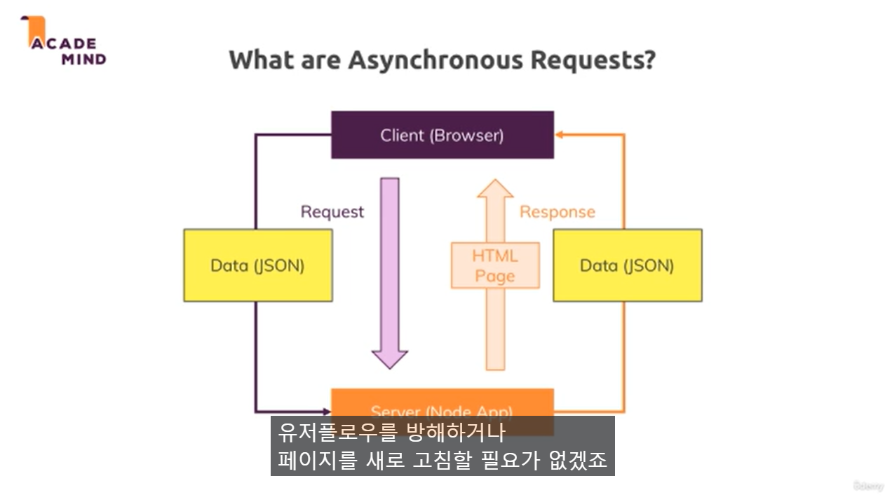

# Section 22: 비동기 요청 이해

### 347. 모듈 소개

- Behind the scenes work

### 348. 비동기 요청의 이해



- 새 HTML 페이지를 가져오지 않고 일정 데이터를 주고 받기
- 비동기식 데이터는 JSON이라는 특별한 형식의 데이터를 포함하는 형식
- 그럼 서버가 데이터를 가지고 일정 작업을 한 후 응답을 보냄
- 즉, 응답으로 새 HTML 페이지를 렌더링 하지 않음

### 349. 클라이언트 측 js 코드 추가하기

```js
// views/admin/products.ejs
    <div class="card__actions">
        <a href="/admin/edit-product/<%= product._id %>?edit=true" class="btn">Edit</a>
        <input type="hidden" value="<%= product._id %>" name="productId">
        <input type="hidden" name="_csrf" value="<%= csrfToken %>">
        <button class="btn" type="button" onclick="deleteProduct(this)">Delete</button>
    </div>

// ...

            <script src="/js/admin.js"></script>

```

### 350. JSON 데이터 형식

JSON이란 무엇일까요

JSON은 JavaScript Object Notation의 약자로, 일반적인 JSON 데이터의 구조는 다음과 같습니다.

```json
{
  "name": "Your Name",
  "age": 29,
  "courses": ["angular-the-complete-guide", "react-the-complete-guide"],
  "profile": {
    "joined": "2017-05-21",
    "courses": 2
  },
  "averageRating": 4.8,
  "active": true
}
```

일반적인 JavaScript 객체와 비슷해 보이죠. 한 가지 다른 점은 모든 키 이름이 큰따옴표(") 안에 있다는 겁니다.

그 외에도, 텍스트 (문자열), 숫자 (정수와 실수), 불리언 데이터뿐만 아니라 중첩된 객체 및 배열을 저장할 수 있어요.

더 자세히 알아보려면, 다음 페이지를 참고하세요. https://www.json.org/

### 351. 백그라운드 요청 전송 및 처리하기

```js
// routes/admin
router.delete("/product/:productId", isAuth, adminController.deleteProduct);

// controllers/admin
exports.deleteProduct = (req, res, next) => {
  const prodId = req.params.productId;
  Product.findById(prodId)
    .then((product) => {
      if (!product) {
        return next(new Error("Product not found."));
      }
      fileHelper.deleteFile(product.imageUrl);
      return Product.deleteOne({ _id: prodId, userId: req.user._id });
    })
    .then(() => {
      console.log("DESTROYED PRODUCT");
      res.status(200).json({ message: "Success!" });
    })
    .catch((err) => {
      res.status(500).json({ message: "Deleting product failed." });
    });
};
```

- http 페이지를 리다이렉트 하는게 아니라 JSON 데이터를 return 하도록 변경

### 352 DOM 조작

```js
// public/js/admin
fetch("/admin/product/" + prodId, {
  method: "DELETE",
  headers: {
    "csrf-token": csrf,
  },
})
  .then((result) => {
    return result.json();
  })
  .then((data) => {
    console.log(data);
    productElement.parentNode.removeChild(productElement);
  })
  .catch((err) => {
    console.log(err);
  });
```

- 비동기적으로 응답을 받아오고 데이터를 success하면 페이지에서 해당 노드를 제거

### 353. 참고자료

- [fetch API 더알아보기](https://developers.google.com/web/updates/2015/03/introduction-to-fetch)

- [AJAX Requests 더 알아보기](https://developer.mozilla.org/en-US/docs/Web/Guide/AJAX/Getting_Started)
