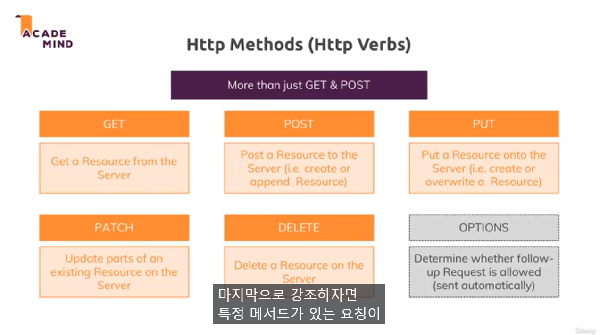

# Section 24: REST APIs

### 359. 모듈 소개

- Decoupling Frontend and Backend
- EJS 템플릿 -> REST APIs

- REST APIs 란?
- 왜 REST APIs를 사용하나>
- REST의 핵심 개념

### 360. REST API 정의 및 사용 이유?

- What & why?

  - 모든 프론트엔드 사용자 인터페이스가 HTML 페이지를 사용하지 않는다.
    - SPA : 브라우저에서 js를 실행하여 DOM을 그리고
    - js 스크립트 파일이 백엔드 API(RESTful API)에 도달해 사용자 인터페이스에 재렌더링해야하는 데이터만 가져오도록한다.
    - 새로운 HTML을 가져오는게 아니라 초기의 HTML에서 js가 다루는 DOM을 구성함

- Service APIs(google maps)

- Representational State Transfer
  - 사용자 인터페이스 대신 데이터 전송

### 361. REST API로 데이터 액세스하기

- 데이터만 저장하고 싶을 때 가장 좋은 전송 형식은 JSON
- 그 외 형식들... HTML, plainText, XML

### 362. 라우팅과 HTTP 메소드 이해하기



### 363. REST API - 핵심원칙

- 일관된 인터페이스
  - Clearly defined API endpoints with clearly defined request + response data structure
  - 명확하게 정의된 API endpoints를 가져야한다.
    - endpoints는 명확하게 정의된 요청 및 응답 데이터 구조를 가진 http 메서드 및 경로의 조합
- Stateless Interactions
  - Server and client don't store. any connection history, every request is handled seperately
  - 클라이언트와 서버는 분리되어있다. 따라서 연결 히스토리가 저장되지 않고 들어오는 모든 요청에 대해 사전 요청을 보내지 않은 것으로 처리
- cacheable

### 366. REST API, 클라이언트 및 CORS 오류

- CORS?
- Cross-Origin Resource Sharing
  - API와 클라이언트가 서로 다른 도메인에서 데이터를 주고 받으려할 때 CORS 에러 발생

```js
app.use((req, res, next) => {
  res.setHeader("Access-Control-Allow-Origin", "*");
  res.setHeader(
    "Access-Control-Allow-Methods",
    "OPTIONS, GET, POST, PUT, PATCH, DELETE"
  );
  res.setHeader("Access-Control-Allow-Headers", "Content-Type, Authorization");
  next();
});
```

- Access-Control-Allow-Origin : 특정 출처에서 데이터 액세스 허용
- Access-Control-Allow-Methods : 특정 http 메서드 사용 허용
- Access-Control-Allow-Headers : `'Content-Type, Authorization'`을 무조건 추가해야 authorization 데이터 요청을 보낼 수 있다.

### 369. 참고자료

- [예시, RESTful API 만들기 참고자료](https://academind.com/learn/node-js/building-a-restful-api-with/)
