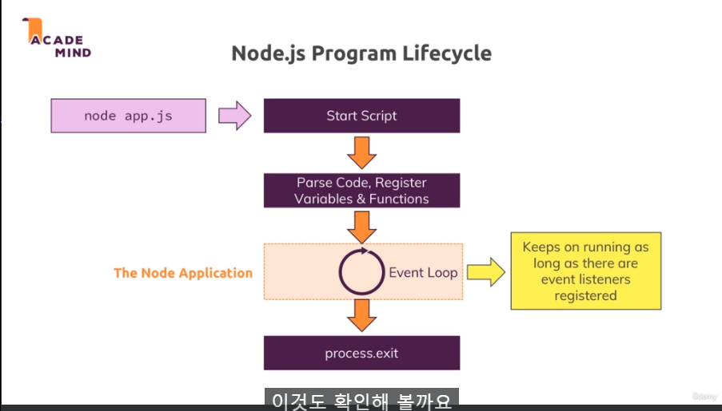
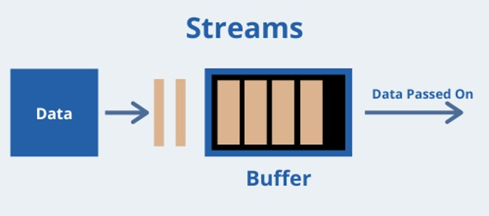

### 26. Node 서버 생성

NodeJS에서는 기본으로 탑재된 몇개의 모듈이 있다.

코어 모듈 - http, https, fs, path, os
- https: 서버 출시
- https: 암호화 ssl

### 27. Node의 라이프사이클 및 이벤트 루프
</img>

**이벤트 루프**는 이벤트 리스너가 남아있는 한 계속해서 작동한다. 
createServer로 만든 이벤트 리스너는 서버가 계속 운영되기위해 제거되지 않아야한다. 
코어 노드 애플리케이션은 이 이벤트 루프에 의해 관리된다. 
이 이벤트 루프는 싱글 스레드 자바스크립트 특징을 가진다. 
제거해야한다면  proseed.exit를 사용

### 31. 요청과 응답 헤더
요청, 응답 데이터를 A에서 B로 이동하기위해 Http 헤더를 추가해야한다. 
사용가능한 헤더와 각각의 역할을 간략하게 알아보려면 다음을 참고 
[mdn web docs 보러가기](https://developer.mozilla.org/en-US/docs/Web/HTTP/Headers)

### 34. 요청 본문 분석

</img>
파일 작업을 할 때 스트림과 버퍼 개념 
스트림은 지속적인 프로세스이다. 
데이터는 스트림을 통해 일정한 흐름으로 지속적으로 전달된다. 
노드가 많은 양을 한 청크씩 읽고 전체를 읽기까지 기다리지 않고도 각각의 청크를 다룰 수 있다. 

하지만 데이터를 미리 다룰 수 있다. 
문제는 코드를 사용해 청크를 마음대로 다룰 수 없고 대신에 들어오는 청크를 체계화 하기위해 버퍼를 대체한다. 
버퍼는 버스스탑과 같다. 
버스는 항상 달리지만 사용자가 버스에 타고 내리려면 버스를 찾기 쉽도록 버스 정류장이 있는 역할 
여러개의 청크를 보유하고 파싱이 끝나기 전에 작업할 수 있게 한다. 

스트림은 데이터를 하나의 청크로 나누어 처리하기 때문에 대용량 파일이나 네트워크에서 실시간으로 데이터를 전송할 때 매우 유용하다. 
스트림은 버퍼라는 일종의 임시 저장 공간을 사용하여 데이터를 처리한다. 

### 36. 블로킹 논블로킹 코드

이 부분 너무 어렵다.. 5번 들었는데도 이해가 안되서 그냥 넘어가는데 나중에 꼭 이해를 하도록
()[https://inpa.tistory.com/entry/%F0%9F%91%A9%E2%80%8D%F0%9F%92%BB-%EB%8F%99%EA%B8%B0%EB%B9%84%EB%8F%99%EA%B8%B0-%EB%B8%94%EB%A1%9C%ED%82%B9%EB%85%BC%EB%B8%94%EB%A1%9C%ED%82%B9-%EA%B0%9C%EB%85%90-%EC%A0%95%EB%A6%AC]
### 37. Node 백그라운드 확인

싱글스레드 ,이벤트루프, 블로킹 코드

